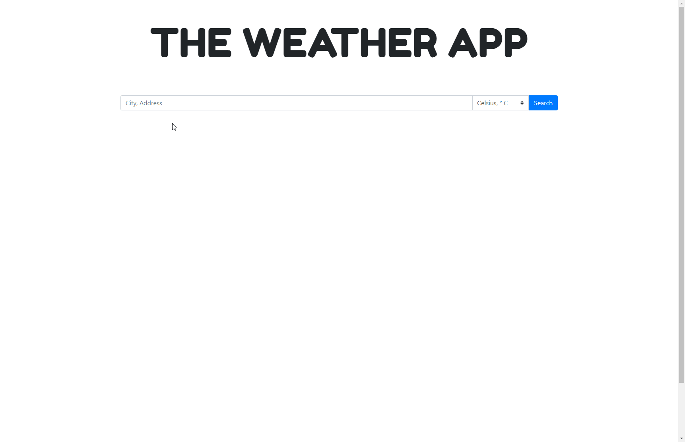

# Weather App

Version 1 of weather app using Open weather API and Open Cage API.

Enter city name or address in the search field, choose your preferred unit and click search. Weather data for the next 8 days (including today, marked with black border) is presented to you.

Sample:

Live app deployed to Heroku: [Weather App](https://boiling-coast-44144.herokuapp.com/) (if the app was not used for a while heroku needs few more seconds to reinitialize the app)

## APIs used
  - [Open Weather](https://openweathermap.org/)
  - [Open Cage](https://opencagedata.com/)

## Technologies used:
  - Node.js (Express)
  - Nodemon
  - EJS
  - jQuery
  - Bootstrap
